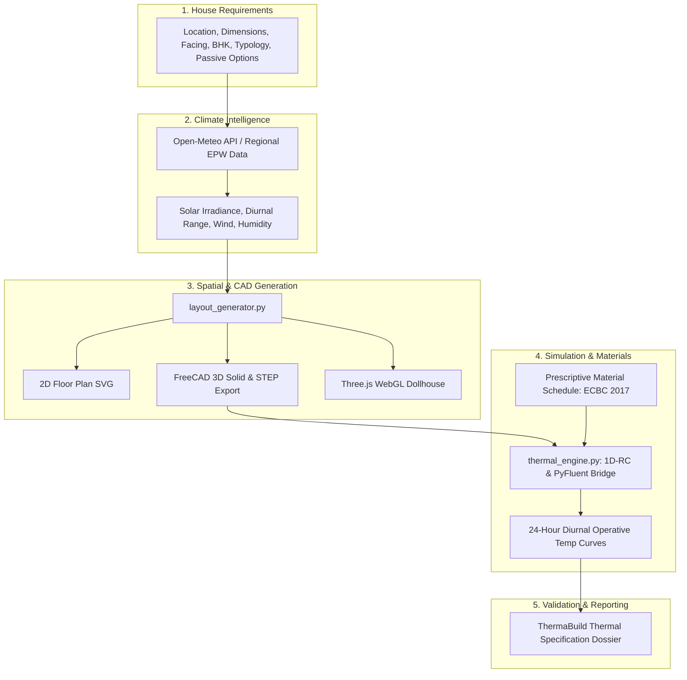

<div align="center">

# 🏛️ ThermaBuild

**Intelligent Thermal-Aware Bioclimatic House Design & Simulation Platform**

[](LICENSE)
[](requirements.txt)
[](demo/viewer/)
[](scripts/freecad_build.py)
[](scripts/thermal_engine.py)

<br/>

*Design Better Homes. Build for the Climate.*

<br/>

```bash
# Clone & install dependencies
./install.sh

# Run the unified ThermaBuild platform
source .venv/bin/activate
python scripts/server.py
```

Open **http://localhost:8765/demo/index.html** in your browser.

</div>

---

## ✨ Highlights

- **Guided Bioclimatic Configurator** — Tune plot dimensions, facing direction, house typology (Villa, Courtyard, Row House), bedrooms, and passive design constraints.
- **Hyper-Local Climate Intelligence** — Automated microclimate analysis for ambient temperature swings, solar radiation, humidity, and wind vectors (integrated with Open-Meteo API & regional EPW data).
- **Procedural 2D Architectural Plans** — Dynamic generation of spatial layouts with furniture placement, window openings, and thermal room zoning in scalable SVG format.
- **Parametric 3D CAD & FreeCAD STEP Export** — OpenCASCADE solid geometry generation exporting standard `house.step` boundary files ready for CFD mesh generation.
- **Interactive Three.js 3D Dollhouse** — Real-time WebGL walkthroughs with cutaway walls, PBR materials, doors, and animated ceiling fans.
- **Conjugate Heat Transfer & Diurnal Simulation** — 24-hour diurnal thermal heat balance solver computing indoor operative temperatures, heat ingress mitigation (-40%+), and passive cooling energy savings.
- **Future-Proof PyFluent Bridge** — Clean decoupled driver interface ready to connect to local or remote ANSYS Fluent instances via gRPC.
- **Vedic Vastu Alignment** — Integrated room quadrant orientation analysis (NE pooja/water, SE kitchen/fire, SW master bed/earth).
- **Executive Thermal Design Dossier** — One-click generation of full-screen, print-ready client reports with U-value schedules and thermal compliance verdicts.

---

## 🧭 Architecture Flow



---

## 🚀 Quick Start

### 1. Prerequisites & Installation

```bash
# Make scripts executable and run setup
chmod +x install.sh
./install.sh

# Sanity check installed tools
./scripts/verify_tools.sh
```

### 2. Launch the Unified Platform

```bash
source .venv/bin/activate
python scripts/server.py
```

### 3. Open Web Interfaces

| Interface | URL |
|-----------|-----|
| **ThermaBuild SaaS Studio** | http://localhost:8765/demo/index.html |
| **2D Floor Plan Builder** | http://localhost:8765/demo/floor-plan-viewer/index.html |
| **3D Interactive Dollhouse** | http://localhost:8765/demo/viewer/index.html |
| **System Health API** | http://localhost:8765/api/health |

---

## 📦 API Endpoints

ThermaBuild provides a future-proof REST API for external integrations:

### `POST /api/generate`
Generates a complete parametric 2D/3D house plan and solves the thermal simulation.

**Request Payload:**
```json
{
  "city_key": "jaipur",
  "city_name": "Jaipur",
  "latitude": 26.9124,
  "longitude": 75.7873,
  "width_m": 14.0,
  "depth_m": 12.0,
  "facing": "E",
  "bhk": 3,
  "floors": "G+1",
  "typology": "villa",
  "passive_options": {
    "vastu": true,
    "night_purge": true,
    "overhang": true
  }
}
```

**Response:**
Returns `{ status: "ok", project_id, layout, climate, materials, simulation, viewer_3d_url }`.

### `POST /api/climate`
Fetches live microclimate conditions for the specified latitude and longitude.

### `GET /api/health`
Returns driver readiness for Python, FreeCAD, Blender, and PyFluent.

---

## 🛠 Tech Stack

| Layer | Technologies |
|-------|--------------|
| **Frontend** | Vanilla JS, Modern CSS Glassmorphism, Arfolit / Plus Jakarta Sans Typography |
| **3D WebGL** | Three.js, OrbitControls, GLTFLoader, PBR Shaders |
| **CAD / BIM** | FreeCAD (Python OpenCASCADE API), STEP Export, SVG Generators |
| **Thermal & CFD** | lumped parameter 1D-RC solver, PyFluent (`ansys.fluent.core`) Bridge |
| **Climate API** | Open-Meteo REST API, Swiss Ephemeris (`pyswisseph`) |
| **Backend** | Python 3.12, Flask, Flask-CORS |

---

## 📄 License

MIT License — see [LICENSE](LICENSE).
