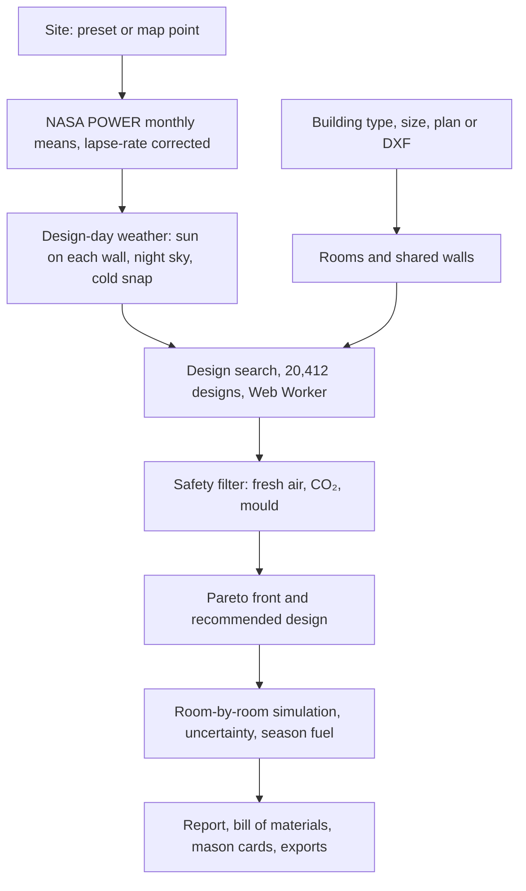

<div align="center">

# 🏛️ ThermaBuild

**Passive-solar design for India's cold regions, computed room by room in the browser**

[](LICENSE)
[](demo/js/engine/engine.test.mjs)
[](scripts/check_engine_parity.py)

<br/>

```bash
cd demo && python3 -m http.server 8811
```

Open **http://localhost:8811/index.html**. The studio, its engine and its data all load from this folder, so it works offline. The map tiles and live climate for arbitrary map points need internet; the ten preset sites do not.

</div>

---

## ✨ What it does

- **Real climate, corrected for altitude.** It uses NASA POWER monthly means for 2001–2020, stored for ten sites (Leh, Nubra, Kargil, Dras, Pangong, Kaza, Delhi, Chennai, Jaisalmer, Bengaluru). Any other map point is fetched live. Temperatures are shifted from the reanalysis grid cell's elevation to the site's own with the 6.5 K/km lapse rate. The Leh cell is about 1,000 m above the town.
- **Room-by-room heat balance.** Each room uses the ISO 13790 / ISO 52016 simple hourly (5R1C) network, and rooms are linked through their internal walls. The model covers:
  - sun on each wall, using solar geometry and the Erbs diffuse split;
  - night-sky radiation (Swinbank);
  - thinner air at altitude;
  - ground heat loss per ISO 13370;
  - Trombe walls and night shutters.

  It is solved with implicit Euler in 15-minute steps, and energy is conserved exactly.
- **Design search.** 20,412 combinations are simulated per site in about 1 second in a Web Worker:
  - wall and insulation, roof and glazing;
  - share of south glass;
  - Trombe wall;
  - airtightness;
  - plan proportion;
  - shutters.

  Orientation is then refined on the best designs. A Pareto front on dawn temperature, cost and embodied carbon gives Budget, Recommended and Warmest picks, using materials a local mason can source.
- **Safety is enforced.**
  - Fresh air never drops below what people and the stove need; a vent is sized instead.
  - The design keeps CO₂ at or below 1,400 ppm.
  - Designs at risk of mould on the inside walls (ISO 13788) are rejected.
  - A worst-case CO check covers an unflued heater.
  - Cold-snap risk is rated in bands.
- **Night-by-night report.** It covers:
  - three nights, typical or cold snap, with a likely-range band from 80 Monte Carlo runs;
  - a plan with each room coloured by its temperature through the night;
  - where the heat goes;
  - what each feature is worth;
  - a 12 × 24 year calendar;
  - winter fuel in litres, ₹ and CO₂, plus a village-impact slider;
  - a bill of materials and payback;
  - printable mason build cards, in English or Hindi;
  - CSV and JSON exports.
- **Beyond houses.** Schools, disaster-relief shelters and high-altitude posts have their own occupancy and heating patterns. Livestock shelters are sized for cattle, yak, goats and sheep, and poultry:
  - cold stress for adults and newborns at cold sites;
  - THI heat stress at hot sites.
- **Your own plan.** You can import a DXF: closed polylines become rooms, and the tool finds which walls face outside, which way they face, and which walls are shared. Alternatively, trace rooms over a plan image.
- **Upgrade an existing home.** Before and after, over a full season, with the payback of each upgrade.
- **The design in 3D.** The house in step 4 is built from the simulated design:
  - rooms and every wall, roof and floor layer at its real thickness;
  - windows with Ladakhi black surrounds, the Trombe wall and night shutters that close at dusk;
  - overhangs, the bukhari flue, the sized fresh-air vent, poplar rafters, the stone plinth and snowy mountains;
  - the sun on its real path for the site and month.

  Views: an exploded view with each layer labelled; roof off, with each room coloured by its simulated temperature; infrared, showing the heat escaping through each surface in W/m²; and wireframe. Labels carry the engine's numbers, and clicking any part explains it.
- **Fine-tuning.** An orientation dial and sliders for the south glass share and the overhang re-run the simulation and carry into the report. Overhang shading uses the sun's profile angle. Materials stay as recommended.
- **Drawings.** An A3 sheet with a plan, section A–A with winter and summer noon sun angles, south and north elevations, a hatched material legend and a title block. It can be printed or downloaded as SVG.

Method, equations, verification and limits: [`demo/methodology.html`](demo/methodology.html).

---

## ✅ Verification

```bash
node --test demo/js/engine/engine.test.mjs            # 46 physics checks; writes demo/data/test-results.js
python3 scripts/check_engine_parity.py # engine vs ISO 13790 Annex C, hour by hour; writes demo/data/parity.js
python3 scripts/fetch_nasa_power.py    # refresh the stored climate (needs internet)
python3 scripts/make_sample_dxf.py     # regenerate the sample DXF plan
```

The checks cover:
- energy balance at six sites;
- hand-calculated steady state;
- the free-cooling time constant against the network's own eigenvalue;
- time-step convergence;
- design responses that must only move one way (insulation, Trombe wall, shutters, airtightness);
- weather synthesis;
- safety rules;
- ISO 7730 PMV reference cases;
- Pareto optimality;
- determinism.

**Not yet done:** calibration against temperatures measured in Ladakhi buildings. The engine is verified for physics and for agreement with the ISO reference method, not against field data.

---

## 🧭 How it fits together



| Part | File |
|---|---|
| Materials and assemblies | `demo/js/engine/materials.js` |
| Weather synthesis | `demo/js/engine/climate.js` |
| Heat-balance network | `demo/js/engine/thermal.js` |
| Building types and room layouts | `demo/js/engine/design.js` |
| Safety, comfort, fuel, livestock | `demo/js/engine/safety.js` |
| Search and uncertainty | `demo/js/engine/optimise.js`, `optimise.worker.js` |
| Report analysis | `demo/js/engine/analyse.js` |
| Studio wiring and report UI | `demo/js/report.js`, `demo/js/plan-import.js`, `demo/js/i18n.js` |
| 3D house, fine-tuning, drawings | `demo/js/house3d.js`, `demo/js/tune.js`, `demo/js/drawings.js` |

The Python back end in `scripts/`, described below, is older and is not used by the studio. It includes the Flask server, FreeCAD and Blender generators, and the PyFluent script writer. PyFluent only writes journal files; it does not run Fluent.

---

## 📦 Legacy API endpoints

The older Flask server (`scripts/server.py`) still exposes these. The studio no longer calls them.

### `POST /api/generate`
Generates a complete parametric 2D/3D house plan and solves the thermal simulation.

**Request Payload:**
```json
{
  "city_key": "jaipur",
  "city_name": "Jaipur",
  "latitude": 26.9124,
  "longitude": 75.7873,
  "width_m": 14.0,
  "depth_m": 12.0,
  "facing": "E",
  "bhk": 3,
  "floors": "G+1",
  "typology": "villa",
  "passive_options": {
    "vastu": true,
    "night_purge": true,
    "overhang": true
  }
}
```

**Response:**
Returns `{ status: "ok", project_id, layout, climate, materials, simulation, viewer_3d_url }`.

### `POST /api/climate`
Fetches live microclimate conditions for the specified latitude and longitude.

### `GET /api/health`
Returns driver readiness for Python, FreeCAD, Blender, and PyFluent.

---

## 🛠 Tech Stack

| Layer | Technologies |
|-------|--------------|
| **Studio** | Vanilla JS, Instrument Serif and Manrope (stored locally), Leaflet (stored locally), Three.js |
| **Engine** | Plain JavaScript: multi-room 5R1C heat balance, LU solver, Web Worker search, Monte Carlo |
| **Climate** | NASA POWER climatology (stored), Open-Meteo elevation for map points |
| **Checks** | Node's built-in test runner; Python ISO 13790 Annex C parity script |
| **Legacy back end** | Python, Flask, FreeCAD and Blender scripts (not needed by the studio) |

---

## 📄 License

MIT License — see [LICENSE](LICENSE).
